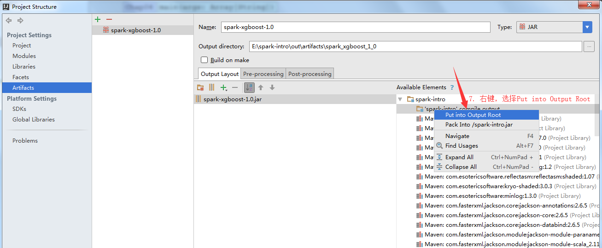

# Intellij打jar包
###### 按如下步骤执行
1.点击【File】，选择【Project Structure】 
 
2.选择【Artifacts】 
 
3.点击【+】，选择【JAR】 
 
4.选择【Empty】 
 
5.输入jar包名称(注意：jar包名称需包含版本号) 
 
6.选择如图所示的compile output目录 
 
7.在此目录上右键，选择【Put into Output Root】 
 
8.只将项目代码放入jar包 
 
9.先点击【Apply】，再点击【OK】 
 
10.点击【Build】，选择【Build Artifacts】 
 
11.选择之前定义的jar名称，点击【Build】 
 
12.查看生成jar的位置 
 